# Burger Dev Team

An agent-based development team plugin for [Claude Code](https://docs.anthropic.com/en/docs/claude-code). Orchestrates 12 specialized AI agent roles through a complete development-to-launch lifecycle, powered by [superpowers](https://github.com/anthropics/superpowers) and 40+ specialized skills.

Instead of reinventing development workflows, Burger Dev Team wraps battle-tested skill chains (brainstorming, planning, TDD, code review, SEO auditing, marketing strategy, etc.) and adds domain-specific expertise for each role — so you get a full dev team without the overhead.

<p align="center">
  
</p>

## Installation

### Option 1: Install from GitHub (recommended)

```bash
claude plugin add github:cookiezGIT/burger-dev-team
```

### Option 2: Clone and install locally

```bash
git clone https://github.com/cookiezGIT/burger-dev-team.git
claude --plugin-dir ./burger-dev-team
```

### Option 3: Add as a project plugin

Add to your project's `.claude/plugins.json`:

```json
[
  {
    "source": "github:cookiezGIT/burger-dev-team"
  }
]
```

### Prerequisites

- [Claude Code](https://docs.anthropic.com/en/docs/claude-code) installed
- A git repository (needed for worktree isolation during the build phase)

### Required Plugin Dependencies

Install these plugins before using Burger Dev Team — each agent delegates to them for execution:

| Plugin | Used By | Install Command |
|--------|---------|-----------------|
| [Superpowers](https://github.com/anthropics/superpowers) | All agents (execution backbone) | `claude plugin add github:anthropics/superpowers` |
| [UI/UX Pro Max](https://github.com/anthropics/ui-ux-pro-max) | burger-build (Frontend Expert) | `claude plugin add github:anthropics/ui-ux-pro-max` |
| [SEO Suite](https://github.com/anthropics/seo) | burger-seo | `claude plugin add github:anthropics/seo` |
| [Marketing Skills](https://github.com/anthropics/marketing-skills) | burger-marketing | `claude plugin add github:anthropics/marketing-skills` |

> **Note**: The SEO and Marketing plugins provide 13+ SEO skills and 25+ marketing skills respectively. If these plugins aren't installed, the corresponding burger agents (`burger-seo`, `burger-marketing`) won't be able to delegate to their specialized sub-skills. The core development agents (phases 1-9) only require Superpowers.

#### Quick install all dependencies

```bash
claude plugin add github:anthropics/superpowers
claude plugin add github:anthropics/ui-ux-pro-max
claude plugin add github:anthropics/seo
claude plugin add github:anthropics/marketing-skills
```

## Quick Start

### Initialize any project with the full team

```
/burger-team:burger-team
```

This auto-detects whether you're starting fresh or onboarding an existing codebase, then runs all 11 phases with approval gates between them.

### Or use individual agents

```
/burger-team:burger-init        # Discover and analyze a project
/burger-team:burger-spec        # Write feature specifications
/burger-team:burger-plan        # Create implementation plan
/burger-team:burger-architect   # Design system architecture
/burger-team:burger-build       # Dispatch implementation agents
/burger-team:burger-review      # Run code review
/burger-team:burger-test        # Assess coverage and write tests
/burger-team:burger-security    # OWASP Top 10 security audit
/burger-team:burger-deploy      # Set up CI/CD and infrastructure
/burger-team:burger-seo         # SEO audit and optimization
/burger-team:burger-marketing   # Marketing strategy and growth
```

## The Team

| Agent | Role | What It Does |
|-------|------|-------------|
| **burger-team** | Orchestrator | Runs the full 11-phase pipeline with approval gates |
| **burger-init** | Discovery Agent | Auto-detects stack, architecture, gaps; produces a Project Brief |
| **burger-spec** | Spec Writer | Transforms requirements into detailed specs with acceptance criteria |
| **burger-plan** | Planner | Creates task-by-task plans with parallel groups, role tags, checkpoints |
| **burger-architect** | System Architect | Designs data models, API contracts, system boundaries with ADRs |
| **burger-build** | Build Dispatcher | Dispatches data/backend/frontend expert subagents in parallel |
| **burger-review** | Code Reviewer | Spec compliance + architecture compliance + code quality review |
| **burger-test** | Tester | Coverage gap analysis, writes integration & e2e tests |
| **burger-security** | Security Expert | Full OWASP Top 10 audit, dependency scan, secret detection |
| **burger-deploy** | DevOps Engineer | CI/CD pipelines, Docker configs, monitoring, health checks |
| **burger-seo** | SEO Expert | Technical SEO, schema markup, content quality, AI search optimization |
| **burger-marketing** | Marketing Strategist | Launch strategy, copywriting, CRO, ads, email, social, growth |

## How It Works

### The Pipeline

```
Discovery → Spec → Plan → Architecture → Build → Review → Test → Security → Deploy → SEO → Marketing
```

Each phase produces artifacts that feed the next:

| Phase | Artifact | Location |
|-------|----------|----------|
| Discovery | Project Brief | `docs/burger-team/project-brief.md` |
| Specification | Feature Specs | `docs/superpowers/specs/*.md` |
| Planning | Implementation Plan | `docs/superpowers/plans/*.md` |
| Architecture | Architecture Doc + ADRs | `docs/burger-team/architecture.md` |
| SEO | SEO Report + Fixes | `docs/burger-team/seo-report.md` |
| Marketing | Marketing Report + Assets | `docs/burger-team/marketing-report.md` |

### Skills Integration

Every agent delegates execution to proven skills rather than reinventing workflows:

```
burger-spec      → superpowers:brainstorming
burger-plan      → superpowers:writing-plans
burger-architect → superpowers:brainstorming + writing-plans
burger-build     → superpowers:executing-plans / subagent-driven-development
                   superpowers:dispatching-parallel-agents
                   superpowers:test-driven-development
                   superpowers:using-git-worktrees
                   ui-ux-pro-max (Frontend Expert)
burger-review    → superpowers:requesting-code-review
burger-test      → superpowers:test-driven-development
                   superpowers:verification-before-completion
burger-security  → superpowers:systematic-debugging
                   superpowers:verification-before-completion
burger-deploy    → superpowers:verification-before-completion
                   superpowers:finishing-a-development-branch
burger-seo       → seo-technical, seo-schema, seo-content, seo-sitemap
                   seo-geo, seo-images, seo-hreflang, seo-plan
burger-marketing → product-marketing-context, copywriting, page-cro
                   launch-strategy, content-strategy, email-sequence
                   paid-ads, ad-creative, social-content, pricing-strategy
                   analytics-tracking, + 15 more marketing skills
```

### New vs Existing Projects

**New projects** run all 11 phases sequentially to scaffold from zero to launched and marketed.

**Existing projects** get a discovery scan first, then the orchestrator recommends which phases to run and which to skip:

```
Burger Team Execution Plan:
  Phase 1: Discovery       — COMPLETE
  Phase 2: Specification   — NEEDED (no specs found)
  Phase 3: Planning        — NEEDED
  Phase 4: Architecture    — SKIP (solid architecture detected)
  Phase 5: Implementation  — NEEDED
  Phase 6: Review          — NEEDED
  Phase 7: Testing         — PARTIAL (tests exist, gaps in coverage)
  Phase 8: Security        — NEEDED
  Phase 9: Deployment      — SKIP (CI/CD already configured)
  Phase 10: SEO            — NEEDED (no sitemap, missing schema markup)
  Phase 11: Marketing      — NEEDED (no landing page copy, no launch plan)
```

### Build Phase: Expert Subagents

During implementation, `burger-build` dispatches specialized subagents with injected expertise:

- **Data Expert** — schema design, migrations, ORMs, query optimization
- **Backend Expert** — APIs, auth, middleware, services, error handling
- **Frontend Expert** — components, state management, routing, accessibility, powered by `ui-ux-pro-max` for production-grade design quality

Independent tasks run in parallel. All subagents enforce TDD (red-green-refactor).

### SEO Phase: Multi-Dimensional Analysis

`burger-seo` orchestrates 8+ specialized SEO skills covering:

- Technical SEO (crawlability, indexability, Core Web Vitals, security headers)
- Schema markup (JSON-LD structured data for rich results)
- Content quality (E-E-A-T assessment, thin content detection)
- Sitemap validation and generation
- Image optimization (alt text, formats, lazy loading, CLS)
- AI search optimization / GEO (AI Overviews, ChatGPT, Perplexity citability)
- International SEO (hreflang validation)

### Marketing Phase: Full Growth Stack

`burger-marketing` leverages 25+ specialized skills across:

- **Messaging**: Copywriting, copy editing, product positioning
- **Conversion**: Landing page CRO, signup flow, onboarding, popup, form optimization
- **Acquisition**: Paid ads, ad creative, content strategy, social content, cold email
- **Retention**: Email sequences, churn prevention, referral programs
- **Monetization**: Pricing strategy, paywall/upgrade optimization
- **Infrastructure**: Analytics tracking, A/B testing, site architecture, RevOps
- **Strategy**: Launch planning, competitor analysis, marketing psychology

## Supported Project Types

Auto-detects and adapts to:

- SaaS web apps (Next.js, Django, Rails, Laravel, etc.)
- API services (REST, GraphQL, tRPC)
- CLI tools
- Libraries and packages
- Monorepos
- Scrapers and bots
- Static sites and JAMstack

## Plugin Structure

```
burger-dev-team/
├── .claude-plugin/
│   └── plugin.json
├── skills/
│   ├── burger-team/SKILL.md        # Orchestrator
│   ├── burger-init/SKILL.md        # Discovery
│   ├── burger-spec/SKILL.md        # Specification
│   ├── burger-plan/SKILL.md        # Planning
│   ├── burger-architect/SKILL.md   # Architecture
│   ├── burger-build/SKILL.md       # Implementation
│   ├── burger-review/SKILL.md      # Code Review
│   ├── burger-test/SKILL.md        # Testing
│   ├── burger-security/SKILL.md    # Security
│   ├── burger-deploy/SKILL.md      # Deployment
│   ├── burger-seo/SKILL.md         # SEO Expert
│   └── burger-marketing/SKILL.md   # Marketing Strategist
└── README.md
```

## License

MIT
